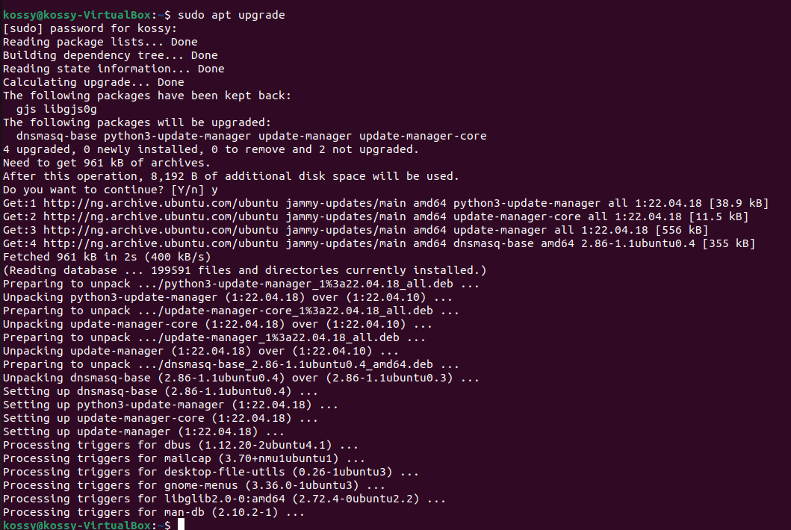

#    LINUX PROJECT INTRODUCTION

## PART 1: RUNNING BASIC COMMAND LINE OPERATIONS

### FILE MANIPULATION
SUDO COMMAND 
> This command lets you perform tasks that require adminstrative or root permission

 

