#    LINUX PROJECT INTRODUCTION

## PART 1: RUNNING BASIC COMMAND LINE OPERATIONS

### FILE MANIPULATION
1) sudo COMMAND 
> This command lets you perform tasks that require adminstrative or root permission

2) pwd COMMAND
> This shows the full current working path

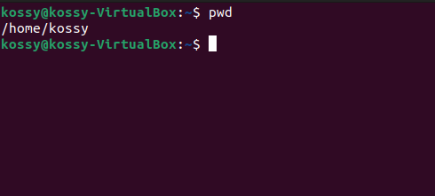 

3) cd COMMAND
> This is used to navigate through Linux files and directories.

4) ls COMMAND
> This is used to list files and directories in a system

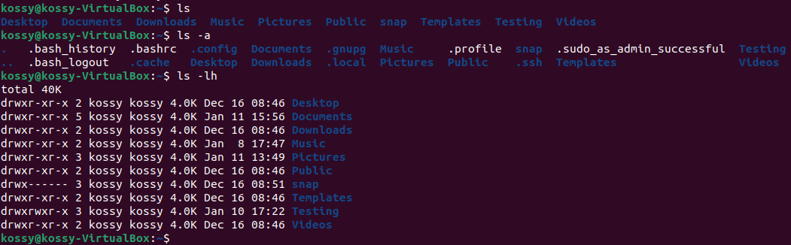

5) cat COMMAND
> cat lists, combines and writes files content to the standard output

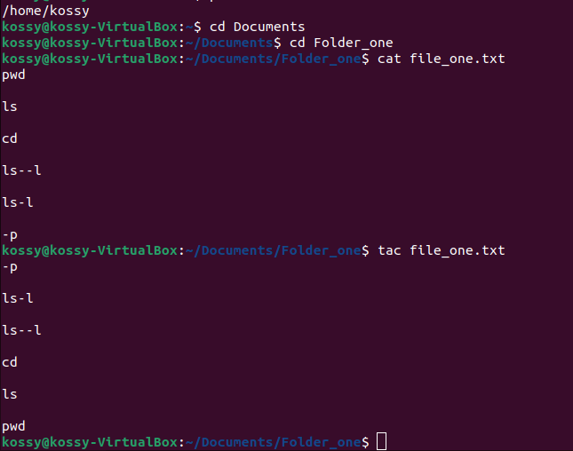

6) cp COMMAND
> This is used to copy files or directories and their content

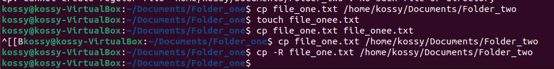

7) mv COMMAND
> This is used to move and rename files or directories

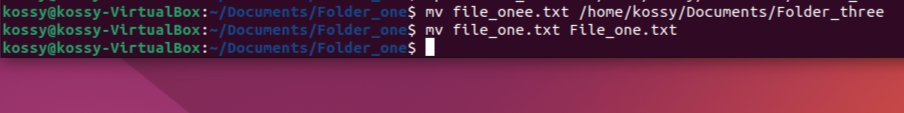

8) mkdir COMMAND
> This is used to create files or directories and set permission for them

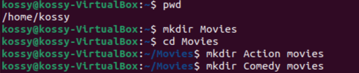

9) rmdir COMMAND
> This is used to permanently delete an empty directory

10) rm COMMAND
> This is used to delete files within a directory

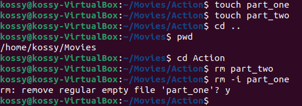

11) touch COMMAND
> This command allows you to create an empty file

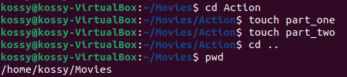

12) locate COMMAND
> This helps to find files in the database system

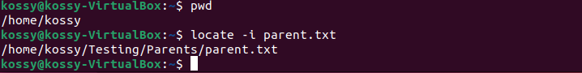

13) find COMMAND
> This is used to search for files in a specific directory

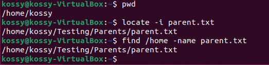

14) grep COMMAND
> This helps you find a word by searching all through the texts in a specific file

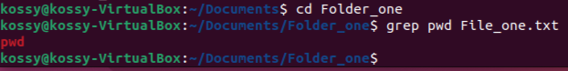

